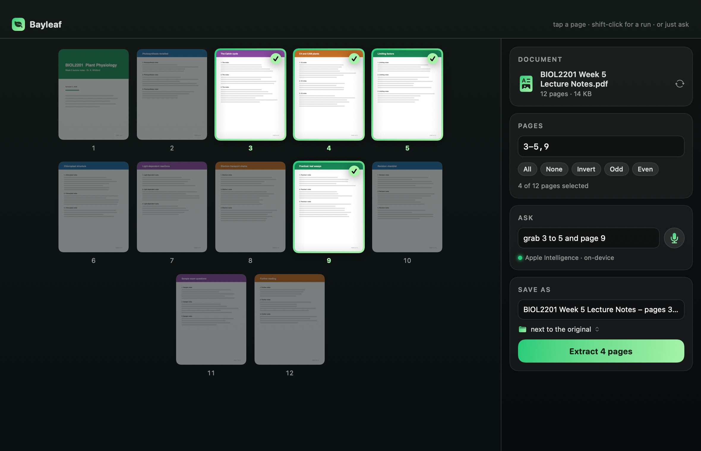

# Bayleaf

Pull pages out of a PDF — **tap them, type a range, or just ask**, typed or out loud.
The asking is understood on your Mac by Apple Intelligence; nothing you open, say,
or extract ever leaves the machine.

Drop a PDF on the window, pick pages any way you like, and Bayleaf writes a new PDF
with just those pages — a sensible filename already suggested, never overwriting
anything. Signed with a Developer ID and notarised by Apple, so Gatekeeper stays quiet.

## Three ways to pick pages

- **Tap** thumbnails — shift-click for a run, or the All · None · Invert · Odd · Even chips
- **Type** a range: `1-3,5,8-10` · `l` for the last page · `3-l` · `odd`
- **Ask** — *"the last three pages"*, *"everything except page 4"*, *"5 to 9 and the
  cover"* — or press the mic and say it. Interpreted on-device; with Apple
  Intelligence switched off, simple phrasings still work.

## Requirements

macOS 26 (Tahoe) or later on Apple Silicon. First use of the mic asks for
microphone and speech-recognition permission — both stay on-device.

## Build from source

    ./Scripts/build.sh          # signed app → dist/Bayleaf.app   (SIGN=0 to skip signing)
    ./Scripts/notarize.sh       # notarised, stapled DMG           (creds: see .env.example)

The binary is its own test harness — try
`.build/release/Bayleaf --interpret "the last three pages" 42`.
Design details live in [SPEC.md](SPEC.md).

---

MIT — see [LICENSE](LICENSE). Made for my daughter. 🌿
